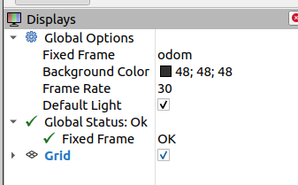

# micromouse_maze

Creates a maze world and spawns a turtlebot3 at one of the corners of the maze (either at (7.5m, 7.5m) or (-7.5m, 7.5m) or (-7.5m, -7.5m) or (7.5m, -7.5m)) facing outwards.

The size of the maze is 16m x 16m.

The maze is centered in the world. So the very center of the maze correspondes to x=0 and y=0  coordinates.

To be able to finish the maze you should reach to the target square with center located at x=0 and y=0 coordinates and each side of 2m.

A sample view from the simulation world can be seen in the following Fig.


# Install

```
cd ~/robotlar_ws/src
git clone https://gitlab.com/blm6191_2023_1/blm6191/micromouse_maze.git
cd ~/robotlar_ws
catkin_make
source ~/.bashrc
```

Make sure that you have defined waffle as default robot type
```
echo "export TURTLEBOT3_MODEL=waffle" >> ~/.bashrc
source ~/.bashrc
```

Also make sure your workspace is defined within GAZEBO_MODEL_PATH variable
```
echo "export GAZEBO_MODEL_PATH=${GAZEBO_MODEL_PATH}:~/robotlar_ws/src/" >> ~/.bashrc
source ~/.bashrc
```

# Run
Run with maze 1:
```
roslaunch micromouse_maze micromouse_maze1.launch
```

Run with maze 2:
```
roslaunch micromouse_maze micromouse_maze2.launch
```

# Check for the Following

After you run the launch files check for the tf tree with the following command in a new terminal window.

```
rosrun rqt_tf_tree rqt_tf_tree
```
You should see a tf tree similar to following Fig. 


Roslaunch also starts Rviz window with a predefined config. Check for the following: 

- fixed frame is set to odom



- LaserScan message and TF message are added to Rviz


- odom and base_link TF's are visible and /scan message is visualized


Lastly check for the topic list command and its result as follows in a new terminal window

```
$ rostopic list
/camera/depth/camera_info
/camera/depth/image_raw
/camera/depth/points
/camera/parameter_descriptions
/camera/parameter_updates
/camera/rgb/camera_info
/camera/rgb/image_raw
/camera/rgb/image_raw/compressed
/camera/rgb/image_raw/compressed/parameter_descriptions
/camera/rgb/image_raw/compressed/parameter_updates
/camera/rgb/image_raw/compressedDepth
/camera/rgb/image_raw/compressedDepth/parameter_descriptions
/camera/rgb/image_raw/compressedDepth/parameter_updates
/camera/rgb/image_raw/theora
/camera/rgb/image_raw/theora/parameter_descriptions
/camera/rgb/image_raw/theora/parameter_updates
/clicked_point
/clock
/cmd_vel
/gazebo/link_states
/gazebo/model_states
/gazebo/parameter_descriptions
/gazebo/parameter_updates
/gazebo/performance_metrics
/gazebo/set_link_state
/gazebo/set_model_state
/imu
/initialpose
/joint_states
/move_base_simple/goal
/odom
/rosout
/rosout_agg
/scan
/tf
/tf_static
```

